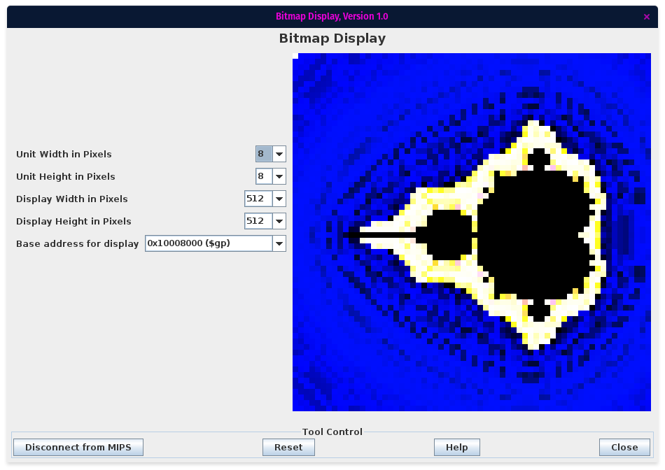
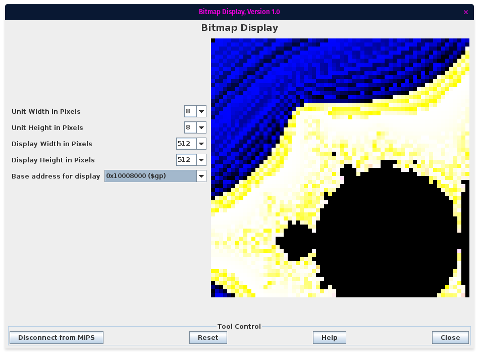
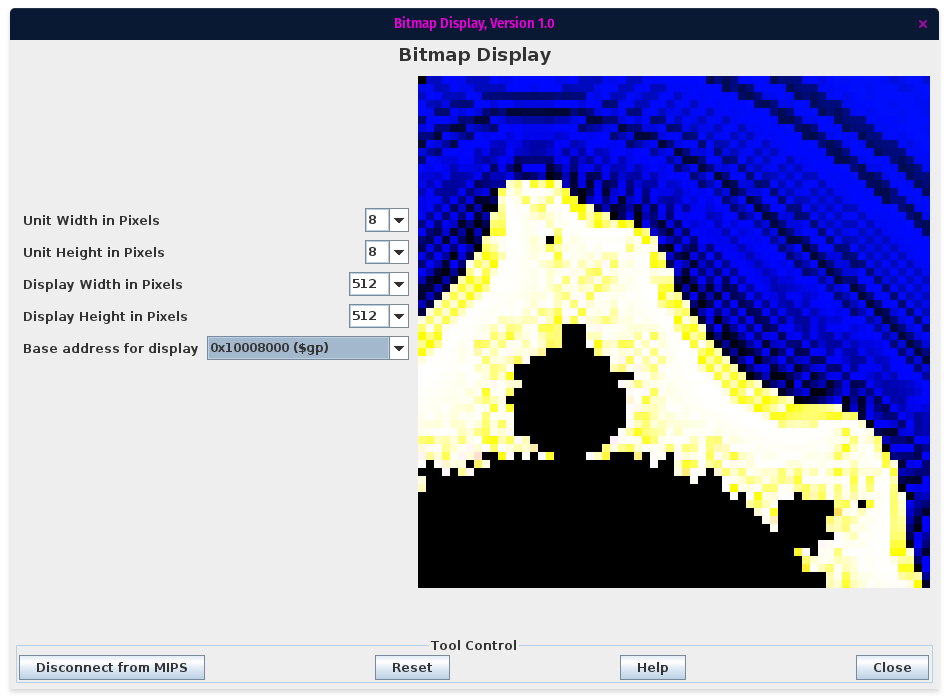
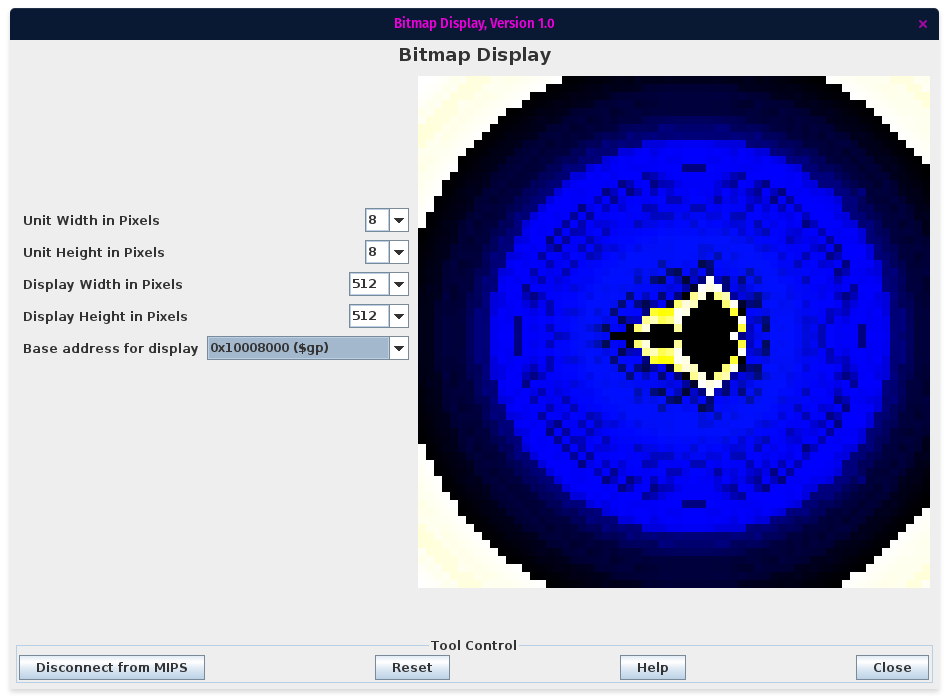
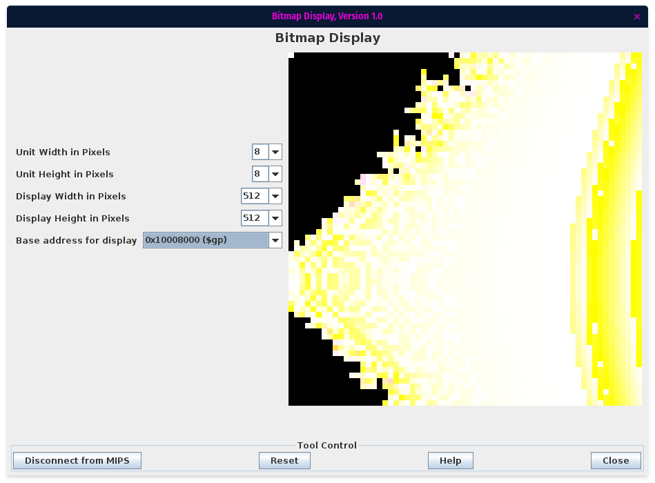
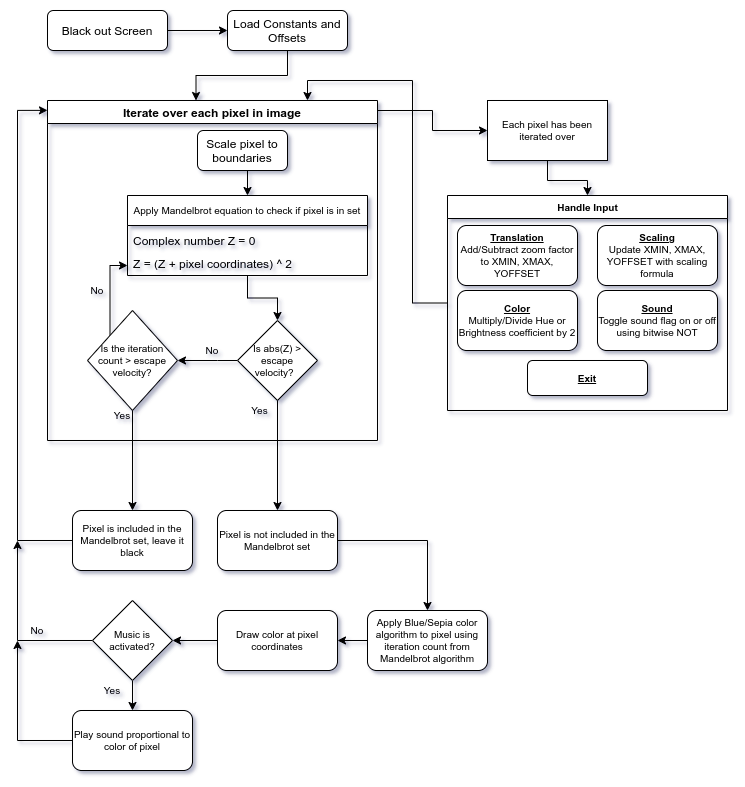

# MIPSelbrot
An interactive mandelbrot fractal viewer written in MIPS

  
Screenshots

  
  
  
  
  
  

## Setup
This program was designed to run in the Mars emulator.

- Open the Bitmap Display
- Set the Unit Width and Height to 8
- Set the Display Width and Height to 512
- Set the Base Address for Display to `0x10008000 ($gp)`
- Open the Keyboard and Display MMIO Simulator
- Connect the Bitmap Display and Keyboard Simulator to Mars
- Assemble and Run the program

## Usage
The viewer supports the following features via the keyboard

| Effect | Command |
| --- | --- |
| Translation | Up - "w"   Down - "s"   Left - "a"   Right - "d"|
| Zoom | In - "z"   Out - "x" |
| Hue Shift | Up - "o"   Down - "l" |
| Brightness Shift | Up - "i"   Down - "k" |
| Toggle sound - default is off, causes significant slowdown | "m" |
| Exit | "space" |

Input is accepted between renders. When a render is complete, the top left pixel will flash black and white.

## How does it work?
I used a modified implementation of the [smooth coloring algorithm](https://en.wikipedia.org/wiki/Plotting_algorithms_for_the_Mandelbrot_set#Continuous_(smooth)_coloring) for the general Mandelbrot set.
This algorithm uses a concept of "escape velocity" to determine if the coordinates of a pixel fall inside of the Mandelbrot set or not. 
For each pixel in the image, the scaled coordinates are added to a complex number which is then multiplied by itself. If the product has an absolute value smaller than the escape velocity, then the coordinates are added to the product which is squared again. This iteration repeats until either

1. The absolute value of the product is greater than the escape velocity
2. The iteration count is greater than the escape velocity

If the latter scenario occurs, that pixel is determined to be a part of the Mandelbrot set, which is colored black. If the former occurs, the pixel will be colored proportionally to how many iterations it took to break the escape velocity. To get a color gradient, pixels are split into Blue and Sepia groups depending on their iteration count.

This process is repeated for each pixel in the image. By increasing our escape velocity, we increase the resolution of the set, however the time taken to compute the image increases drastically. I'm using an escape velocity of 100, which is relatively low compared to most plotters, in order to optimize speed.

Certain optimizations are utilized, for example the Mandelbrot set is symmetric about the Real (horizontal) axis, so if `Y_OFFSET == 0`, we only have to render the top half of the image, and then plot the same pixel but mirrored across the center of the screen.

## Flowchart

## Known Issues
- Zooming does not always put you where you wanted to go, you may end up stuck in a long render loop at the center of the fractal
- Toggling the music on causes a slowdown of around 2 orders of magnitude. Asynchronous MIDI cannot be used due to a bug in Mars audio rendering
- Too many hue or brightness shifts in either direction (more than 10) could be irreversible as the hue and brightness coefficients approach and eventually reach 0
- Superzooms that you can find on YouTube are not possible in this plotter. They typically use BigDouble and other high-level abstractions to be able to plot deeper down into the fractal
