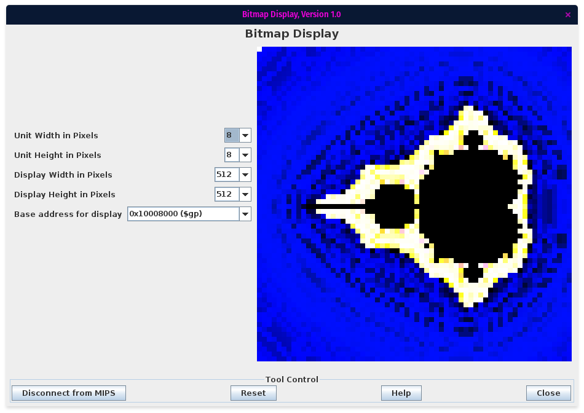

# MIPSelbrot
An interactive mandelbrot fractal viewer written in MIPS

## Setup
This program was designed to run in the Mars emulator.

- Open the Bitmap Display
- Set the Unit Width and Height to 8
- Set the Display Width and Height to 512
- Set the Base Address for Display to `0x10008000 ($gp)`
- Open the Keyboard and Display MMIO Simulator
- Connect the Bitmap Display and Keyboard Simulator to Mars
- Assemble and Run the program

## Usage
The viewer supports the following features via the keyboard

| Effect | Command |
| --- | --- |
| Translation | Up - "w"   Down - "s"   Left - "a"   Right - "d"|
| Zoom | In - "z"   Out - "x" |
| Hue Shift | Up - "o"   Down - "l" |
| Brightness Shift | Up - "i"   Down - "k" |
| Toggle sound - default is off, causes significant slowdown | "m" |
| Exit | "space" |

Input is accepted between renders. When a render is complete, the top left pixel will flash black and white.
